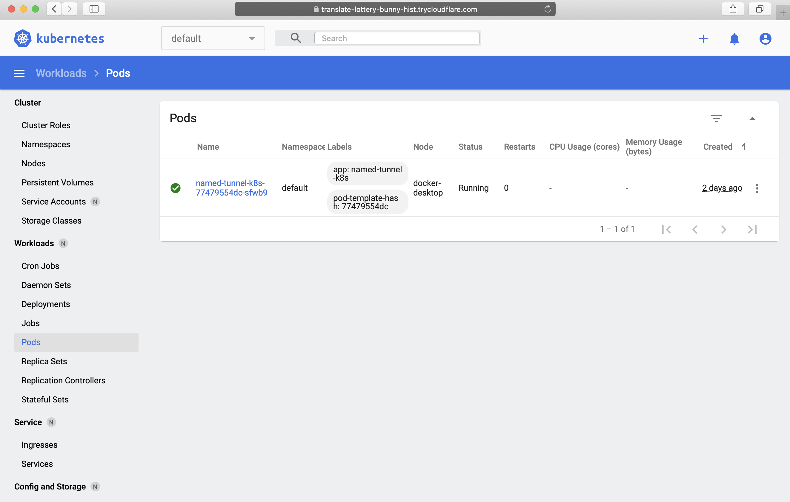

This is an example of using Argo Tunnel to share dashboard your local kubernetes cluster with your collaborators.
It is generally not recommended to expose dashboard of production clusters. If you need to please use [Cloudflare Access](https://teams.cloudflare.com/access/) to secure it.

# Quick Start
1. Start a local kubernetes cluster. https://docs.tilt.dev/choosing_clusters.html offers great insight on choosing a local cluster. 

2. Enable dashboard service

```
    $ kubectl apply -f https://raw.githubusercontent.com/kubernetes/dashboard/v2.0.3/aio/deploy/recommended.yaml
```

3. Install Tilt. See https://docs.tilt.dev/install.html. 

4. Start the services

```
    $ tilt up
```

5. Checkout the hostname for your dashboard. This example uses a [trial version of Argo Tunnel](https://developers.cloudflare.com/argo-tunnel/trycloudflare)
so the hostname is different everytime you restart the dashboard-auth-proxy service. In this example we got `translate-lottery-bunny-hist.trycloudflare.com`.

```
    $ kubectl logs $(kubectl get pod -l app=dashboard-auth-proxy -o jsonpath="{.items[0].metadata.name}" -n kubernetes-dashboard) dashboard-tunnel -n kubernetes-dashboard
    INFO[2020-09-07T16:21:26Z] Cannot determine default configuration path. No file [config.yml config.yaml] in [~/.cloudflared ~/.cloudflare-warp ~/cloudflare-warp /etc/cloudflared /usr/local/etc/cloudflared]
    INFO[2020-09-07T16:21:26Z] Version 2020.8.0
    INFO[2020-09-07T16:21:26Z] GOOS: linux, GOVersion: go1.13.3, GoArch: amd64
    INFO[2020-09-07T16:21:26Z] Environment variables map[proxy-dns-upstream:https://1.1.1.1/dns-query, https://1.0.0.1/dns-query]
    INFO[2020-09-07T16:21:26Z] Environmental variables map[DASHBOARD_AUTH_PROXY_SERVICE_PORT_TUNNEL_METRICS:5000 TUNNEL_METRICS:localhost:5000 TUNNEL_URL:http://localhost:8000]
    INFO[2020-09-07T16:21:26Z] Starting metrics server on 127.0.0.1:5000/metrics
    INFO[2020-09-07T16:21:26Z] Proxying tunnel requests to http://localhost:8000
    ERROR[2020-09-07T16:21:26Z] unable to connect to the origin: Get http://localhost:8000: dial tcp 127.0.0.1:8000: connect: connection refused
    INFO[2020-09-07T16:21:27Z] Connected to DUB
    INFO[2020-09-07T16:21:39Z] Each HA connection's tunnel IDs: map[0:ya0ffsfnhsgf4xqa2d1kkxckldi5vhvizdq9hq6ur6izvr5yyeqg]
    INFO[2020-09-07T16:21:39Z] +------------------------------------------------------------+
    INFO[2020-09-07T16:21:39Z] |  Your free tunnel has started! Visit it:                   |
    INFO[2020-09-07T16:21:39Z] |    https://translate-lottery-bunny-hist.trycloudflare.com  |
    INFO[2020-09-07T16:21:39Z] +------------------------------------------------------------+
```

6. Share the hostname with your collaborator!

    

# Next Step

## Want a consistent hostname?

1. Pick a zone you want to use, and download a certificate to start your tunnel. See https://developers.cloudflare.com/argo-tunnel/quickstart#step-3-login-to-your-cloudflare-account. 

2. Once you have the certificate, add the certificate as a sercret in kubernetes-dashboard namespace. Make sure to change the file path to where your cert is downloaded:

    $ kubectl create secret generic origin-cert -n kubernetes-dashboard --from-file=~/.cloudflared/cert.pem

3. Uncomment the parts marked "with Uncomment when added your origin-cert" in dashboard-auth-proxy/deployment.yaml. 

If tilt didn't pick up your new deployment file, try saving Tiltfile. 

## Secure Access

See https://developers.cloudflare.com/access/setting-up-access/securing-applications/#configure-cloudflare-access on how to configure Access rules.